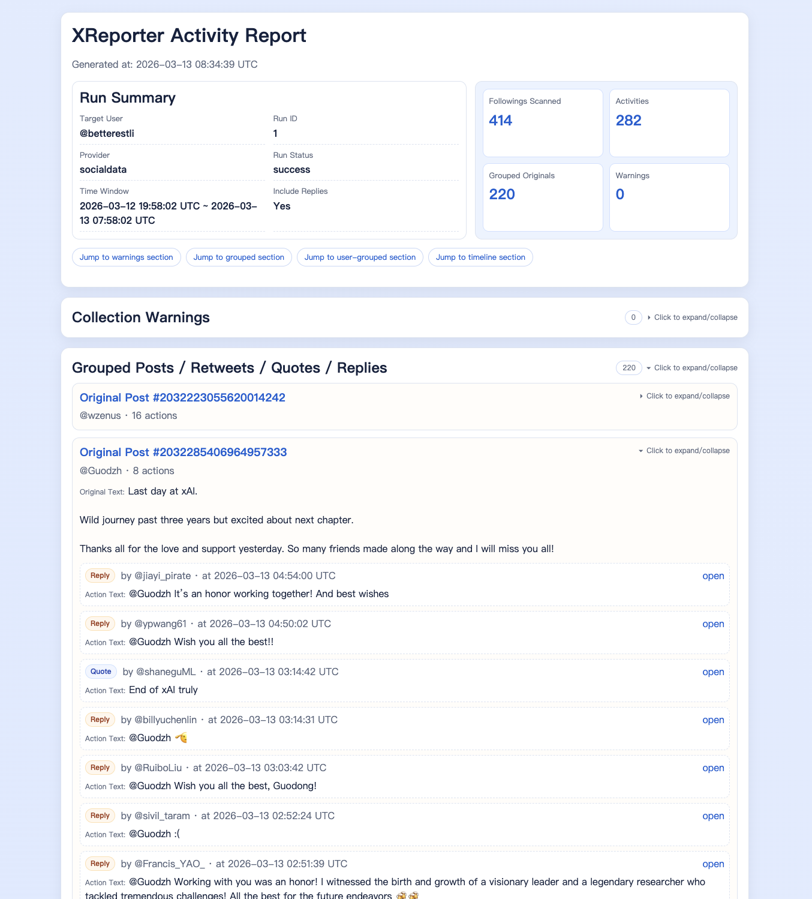
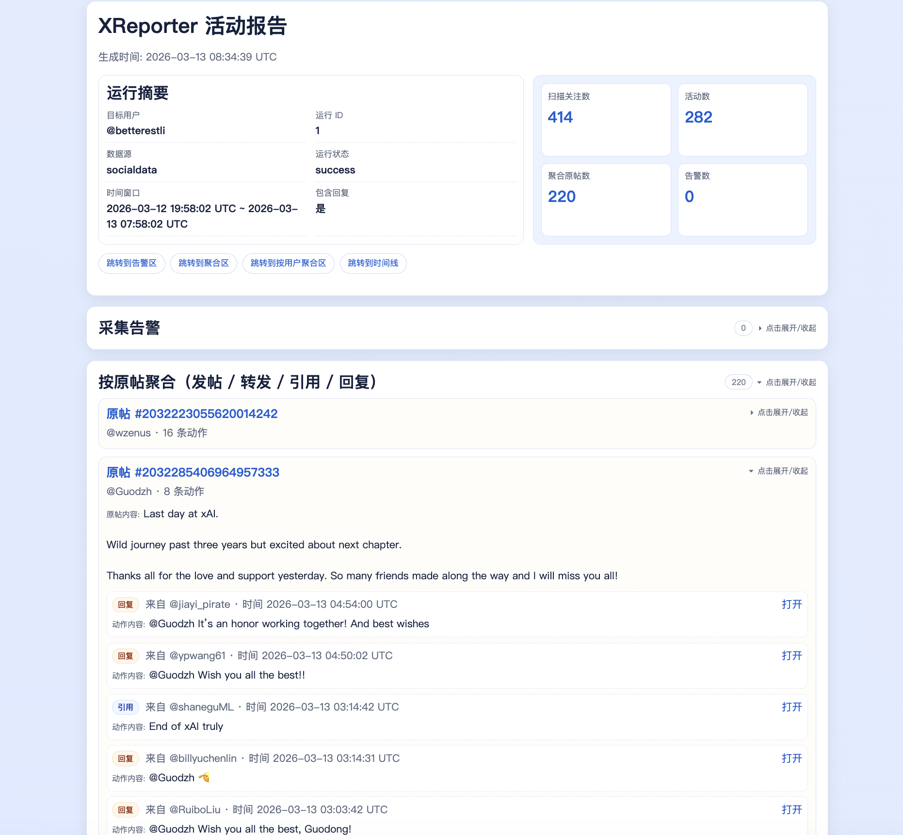

# XReporter

English | [中文](./README_cn.md)

XReporter is a CLI-first pipeline for collecting activity from a target X user's followings, normalizing the data into SQLite, and generating a static HTML report.

Current version: `0.1.0` (MVI)

## Before You Start

- Official X API can be expensive at scale (pricing and quota can become a bottleneck).
- SocialData provider is implemented and tested in this repo, but full production validation is still ongoing.

## Why XReporter

- Keep collection reproducible: each run is tracked (`runs`, `run_activities`, `run_warnings`).
- Keep reruns safe: upsert/idempotent persistence avoids duplicated core records.
- Keep review efficient: HTML report has warning, grouped, user-grouped, and timeline views.
- Keep operations practical: `official`/`socialdata` provider switch + fixture mode for offline testing.

## Quick Navigation

- [3-Minute Quick Start](#3-minute-quick-start)
- [Example Reports](#example-reports)
- [How The Report Is Organized](#how-the-report-is-organized)
- [Technical Route At A Glance](#technical-route-at-a-glance)
- [CLI Reference](#cli-reference)
- [Configuration](#configuration)
- [Logging](#logging)
- [Repository Map](#repository-map)
- [Development And Testing](#development-and-testing)
- [Troubleshooting](#troubleshooting)
- [Contributing](#contributing)

## 3-Minute Quick Start

### 1) Setup environment

```bash
conda env create -f environment.yml
conda activate XReporter
pip install -e .[dev]
```

### 2) Configure credentials (env only)

```bash
# official provider
export X_BEARER_TOKEN="<your_token>"

# socialdata provider
export SOCIALDATA_API_KEY="<your_socialdata_api_key>"
```

Secrets are never persisted into project config files.

### 3) Initialize config

```bash
xreporter config init --username target_user --lang auto
# default provider for new config: official
```

### 4) Collect and render

```bash
xreporter collect --last 24h
xreporter render --latest
```

### 5) Health check

```bash
xreporter doctor
```

## Example Reports

- English sample: [example/run_1_en.html](./example/run_1_en.html)
- Chinese sample: [example/run_1_zh.html](./example/run_1_zh.html)
- Source run: `betterestli`, `--last 12h`, `run_id=1`

English preview:


Chinese preview:


## How The Report Is Organized

Generated report is static HTML and includes:

- Warning section (provider/user/API path/raw error).
- Grouped-by-original section (post/retweet/quote/reply).
- Grouped-by-user section (all activities per actor).
- Chronological full timeline.

Interaction and ordering rules:

- Grouped-by-original, grouped-by-user, and timeline sections are collapsible (default collapsed).
- Each grouped item card is also collapsible (default collapsed) to handle long content.
- Timeline is sorted newest to oldest.
- Grouped-by-original items are sorted by action count (desc), then latest action time (desc).
- Grouped-by-user items are sorted by action count (desc), then latest action time (desc).
- Report language follows config (`en`/`zh`; `auto` resolves by locale with English fallback).

## Technical Route At A Glance

```text
CLI (Typer + Rich)
  -> Config + i18n + logging bootstrap
  -> CollectorService
       -> provider adapter (XApiClient / SocialDataApiClient / FixtureXApiClient)
       -> normalizer
       -> SQLiteStorage
  -> HTML renderer
```

Detailed route: [doc/tech_route.md](./doc/tech_route.md) | [中文](./doc/tech_route_cn.md)

## CLI Reference

1. `xreporter config init --username <name> [--lang auto|en|zh] [--db-path <path>] [--report-dir <path>] [--following-cap <int>] [--include-replies/--no-include-replies] [--api-provider official|socialdata]`
2. `xreporter config show`
3. `xreporter collect [--username <name>] [--last 12h|24h | --since <ISO8601> --until <ISO8601>] [--following-cap <int>] [--include-replies/--no-include-replies] [--api-concurrency <int>] [--resume-run-id <id>]`
4. `xreporter render [--run-id <id> | --latest] [--output <html_path>]`
5. `xreporter doctor`

### Typical workflow

```bash
# 1) init once
xreporter config init --username jack --lang auto --following-cap 200

# 2) collect one window
xreporter collect --last 24h --api-concurrency 4

# 3) render latest run
xreporter render --latest

# 4) or render a specific run
xreporter render --run-id 3 --output ./reports/manual_run_3.html

# 5) resume an interrupted/failed run
xreporter collect --resume-run-id 3 --api-concurrency 4
```

## Configuration

Default config path:

- `~/.xreporter/config.toml`

Config fields:

- `username` (string)
- `language` (`auto|en|zh`)
- `db_path` (string)
- `report_dir` (string)
- `following_cap_default` (int, default `200`)
- `include_replies_default` (bool, default `true`)
- `api_provider` (`official|socialdata`; missing legacy field defaults to `official`)

## Logging

- Default log file: `~/.xreporter/logs/xreporter.log`
- If `XREPORTER_HOME` is set, log path becomes `$XREPORTER_HOME/logs/xreporter.log`.
- Log includes command lifecycle, run-level collection progress, API request/retry/fallback status, and storage commit markers.
- Retried API calls are both logged and printed to terminal (safe summary only, no secrets).
- Optional env vars:
  - `XREPORTER_LOG_LEVEL` (`DEBUG|INFO|WARNING|ERROR`, default `INFO`)
  - `XREPORTER_LOG_STDERR` (`1|true|yes|on`) to mirror logs to stderr

## Provider Notes

- `official`
  - Best aligned with canonical X API schema.
  - Requires `X_BEARER_TOKEN`.
  - Can face strong cost/rate-limit pressure depending on access tier.
- `socialdata`
  - Requires `SOCIALDATA_API_KEY`.
  - Adapter aligns to documented endpoints/params and avoids unsupported filters.
  - Referenced tweet backfill uses batch endpoint (`tweets-by-ids`) to reduce request count.
  - Timeline `403` privacy responses are recorded as warnings and skipped.
  - Full production validation in this repo is still pending.
- Timeline page cap (anti-waste)
  - Per-following timeline collection is capped at **5 pages** by default (both `official` and `socialdata` providers).
  - This is currently a code-level parameter (not a CLI flag).
  - To modify it, edit:
    - `src/xreporter/x_api.py` -> `XApiClient.__init__(..., max_timeline_pages=5)`
    - `src/xreporter/x_api.py` -> `SocialDataApiClient.__init__(..., max_timeline_pages=5)`
- `fixture`
  - Set `XREPORTER_FIXTURE_FILE` to run offline demos/tests without real API calls.

## Data Model

Core SQLite tables:

- `users`, `tweets`, `tweet_links`, `activities`
- `runs`, `run_activities`, `run_warnings`

## Repository Map

```text
src/xreporter/
  cli.py        # command interface and orchestration
  config.py     # config load/save/default paths
  i18n.py       # language resolution and message catalog
  logging_utils.py # runtime logging setup (file rotation + level control)
  models.py     # typed data contracts
  normalizer.py # payload -> normalized batch
  service.py    # collect workflow and warning handling
  storage.py    # SQLite schema, upsert, run metadata
  render.py     # static HTML generation
  time_range.py # last/since/until parsing
  x_api.py      # official/socialdata/fixture clients
tests/
doc/
```

## Development And Testing

```bash
conda activate XReporter
pytest
```

Coverage focus:

- unit: time range parsing, i18n fallback, activity classification, SQLite idempotency
- integration: pagination, retry on `429/5xx`, unresolved referenced tweet fetch
- e2e: fixture `collect -> render`, rerun idempotency, bilingual CLI behavior

## Troubleshooting

### `xreporter doctor` fails on credentials

- Confirm provider in config: `xreporter config show`
- For `official`, check `X_BEARER_TOKEN`
- For `socialdata`, check `SOCIALDATA_API_KEY`

### Render output is empty

- `--latest` may point to a failed run with `0` activities.
- Use `--run-id` to render a known run with data:

```bash
xreporter render --run-id <id> --output ./reports/run_<id>.html
```

### Need request/run diagnostics

- Check `~/.xreporter/logs/xreporter.log` (or `$XREPORTER_HOME/logs/xreporter.log`).
- Set `XREPORTER_LOG_LEVEL=DEBUG` to capture per-request retry/fallback details.

### Collect runs too long

- New pagination safeguards stop repeated cursor/token loops automatically and write warning logs.
- Per-following timeline pagination also has a hard cap of `5` pages by default (see `max_timeline_pages` in `src/xreporter/x_api.py`).
- Increase API parallelism when your quota allows:
  - `xreporter collect --last 24h --api-concurrency 8`
- If runtime is still long, reduce collection scope temporarily:
  - `xreporter collect --last 12h --following-cap 100 --no-include-replies`

### Collection interrupted midway

- Resume the same run without reprocessing completed followings:
  - `xreporter collect --resume-run-id <id> --api-concurrency 4`

### Language does not match expectation

- Set explicit language in config (`en` or `zh`) instead of `auto`.

## Contributing

Issues and PRs are welcome. Suggested contribution flow:

1. Create/focus an issue with expected behavior and scope.
2. Keep modules aligned with repository boundaries (`x_api.py`, `normalizer.py`, `storage.py`, `render.py`, `cli.py`).
3. Add tests for new behavior.
4. Keep English and Chinese docs in sync (`*_cn.md`).

## Related Docs

- Technical route: [doc/tech_route.md](./doc/tech_route.md) / [doc/tech_route_cn.md](./doc/tech_route_cn.md)
- Progress log: [doc/progress.md](./doc/progress.md) / [doc/progress_cn.md](./doc/progress_cn.md)
- Agent conventions: [AGENTS.md](./AGENTS.md) / [AGENTS_cn.md](./AGENTS_cn.md)
